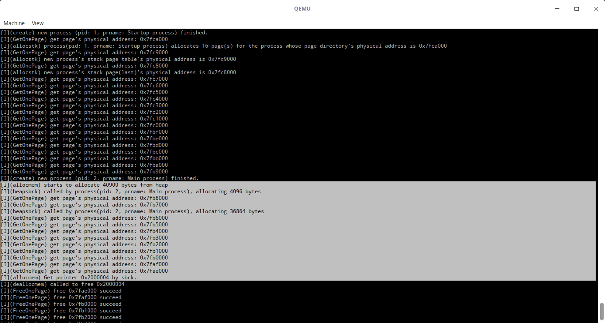
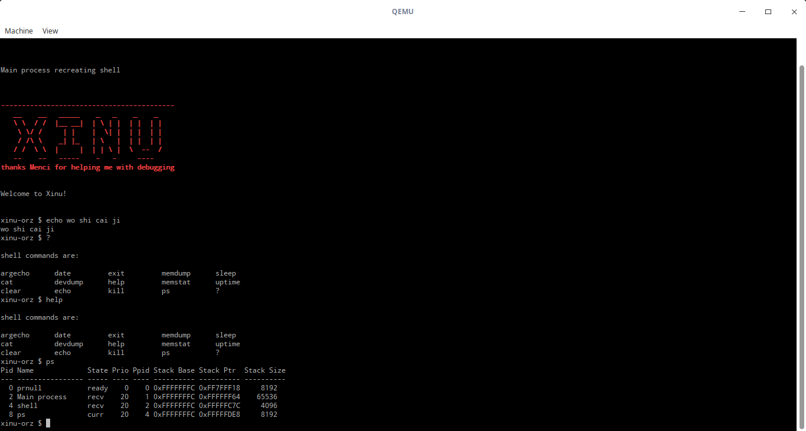

[TOC]

# 虚拟内存实验报告

李国祥 2018202135

## **实验目标**

 在`xinu`上实现虚拟内存以及页式内存管理. 

## **虚拟内存布局**

* [0, 32MB), 这部分空间是内核空间, 为所有进程所共享, `xinu`的代码、数据和`bss`从物理地址的低地址开始编址, 并且它们的大小不会超过32MB, 因此在实现虚拟内存时, 只要将这32MB一一映射到物理地址的起始32MB的空间即可. 但后面又有所改动.
* [32MB, 4GB), 为每个进程所独立的虚拟地址空间, 这部分空间使用动态映射的方式映射到物理地址上.

## **空进程页表及初始化**

这部分一共需要10个页, 1个页目录, 9个页表. 其中, 前8个页表执行从0到32MB的映射, 后1个页表映射内核栈页. 在实现时, 将这10个页放到了**0到32MB这部分的末端, 即[32MB - 10 * 4096, 32MB)**. 页目录中包含这9个页目录的物理地址, 前8个页表在页目录中的索引为0-7, 而内核栈页表在页目录中的索引为1021. 内核栈页在内核栈页表当中的索引为1023. 在程序启动时, 地址还是物理地址,因此我们可以很方便地将这10个页的结构按上面的方式构造好, 将`ebp`和`esp`的值改为启动分页之后的虚拟地址. 然后即可将`cr3`寄存器置为页目录的物理地址, 并且将`cr0`改为对应的值, 以启动分页. 

`initialize.c`: 其中的`InitializeVirtualMemory`完成了上面所述的逻辑并开启页式内存管理.

```c
typedef uint32 table_entry;

struct page
{
	table_entry entries[1024];
};

#define KERNEL_END 0x2000000
#define PAGE_SIZE 4096

static inline void
lcr3(uint32 val)
{
	asm volatile(
		"mov %0, %%cr3\n\t"
		:
		: "r"(val)
		:);
}

void InitializeVirtualMemory(void)
{
	struct page *static_pages = (struct page *)(KERNEL_END - PAGE_SIZE * 10); // 页目录
	memset(static_pages, 0, PAGE_SIZE);
	int i, j;
	for (i = 0; i <= 7; i++)
	{ // 前8个页表. 映射0-32MB
		static_pages[0].entries[i] = (uint32)((char *)static_pages + ((i + 1) * PAGE_SIZE)) | PTE_P | PTE_W;
		for (j = 0; j < 1024; j++)
		{
			static_pages[i + 1].entries[j] = ((i << 10) + j) << 12 | PTE_P | PTE_W;
		}
	}
	static_pages[0].entries[1021] = (uint32)((char *)static_pages + (9 * PAGE_SIZE)) | PTE_P | PTE_W;  // 后1个页表, 映射内核栈页
	memset((char *)static_pages + 9 * PAGE_SIZE, 0, PAGE_SIZE);
	static_pages[9].entries[1023] = 0x6000 | PTE_P | PTE_W; // 映射进程栈0x6ff4所在页
	lcr3((uint32)static_pages); // 写cr3

	is_page = 1; // 标记分页开启
	asm volatile( // 修改%esp. %ebp 开启分页
		"orl $0xff7ff000, %%esp\n\t"
		"orl $0xff7ff000, %%ebp\n\t"
		"movl %%cr0, %%eax\n\t"
		"orl $0x80000000, %%eax\n\t"
		"movl %%eax, %%cr0\n\t"
		:
		:
		: "eax");
}
```

考量上课所讲的ppt示例中的设计, 在`start.S`中进入`nulluser`之前将`ebp`和`esp`设为了0x6ff4. 在启用分页后将内核栈在虚拟地址的位置设为页目录1021, 页表1023的位置, 即0xff7ff页. 因此将(新的页号 | 页内偏移) 赋值给了`ebp`和`esp`, 如代码所示.  使用`orl`指令可以很方便地将这两个寄存器的地址移动到虚拟地址的高端, 而不影响页内偏移.

在`nulluser`中调用该函数, 在`qemu monitor`当中`info tlb`可以发现已经实现了内核虚拟页到物理页的映射.

## **空闲物理页搜索和记录**

原本先实现的虚拟内存初始化, 但为了能够实现物理页的动态分配, 需要搜索和记录空闲的物理页地址. 这里采取的方法是修改`meminit`函数. 这个函数之前的作用是将可用的物理内存块加入`freelist`以初始化链式内存管理. 这里利用这个函数的方法是**当其搜索到空闲内存区段时, 将这一区段所有的物理页放入一个位于低地址数组当中**. 这里利用了类似栈的方法记录. 从上述10个内核页的起始(32MB - 10 * 4096) 开始往前记录. 在初始化虚拟内存之前调用`meminit`即可完成空闲物理页的搜索和记录.

新增的全局变量以及修改后的`meminit`函数:

```c
uint32 free_pages = 0;
uint32 *ptpt = (uint32 *)(KERNEL_END - 10 * PAGE_SIZE); // 从10个内核页往前记录空闲物理页
uint32 total_pages = 0;
uint32 phypagemax; // 最大物理地址, 用于计算某个物理地址在这一部分内存空间中的位置


void ScanFreePages(void)
{

	struct memblk *memptr;			/* Ptr to memory block		*/
	struct mbmregion *mmap_addr;	/* Ptr to mmap entries		*/
	struct mbmregion *mmap_addrend; /* Ptr to end of mmap region	*/
	struct memblk *next_memptr;		/* Ptr to next memory block	*/
	uint32 next_block_length;		/* Size of next memory block	*/

    uint32 tmp_ptr;

	mmap_addr = (struct mbmregion *)NULL;
	mmap_addrend = (struct mbmregion *)NULL;

	/* Initialize the free list */
	memptr = &memlist;
	memptr->mnext = (struct memblk *)NULL;
	memptr->mlength = 0;

	/* Initialize the memory counters */
	/*    Heap starts at the end of Xinu image */
	minheap = (void *)KERNEL_END;   // 从32MB往后搜索
	maxheap = minheap;

	/*** 未做修改 - 开始 ***/
	/* Check if Xinu was loaded using the multiboot specification	*/
	/*   and a memory map was included				*/
	if (bootsign != MULTIBOOT_SIGNATURE)
	{
		panic("could not find multiboot signature");
	}
	if (!(bootinfo->flags & MULTIBOOT_BOOTINFO_MMAP))
	{
		panic("no mmap found in boot info");
	}

	/* Get base address of mmap region (passed by GRUB) */
	mmap_addr = (struct mbmregion *)bootinfo->mmap_addr;

	/* Calculate address that follows the mmap block */
	mmap_addrend = (struct mbmregion *)((uint8 *)mmap_addr + bootinfo->mmap_length);

	/* Read mmap blocks and initialize the Xinu free memory list	*/
	while (mmap_addr < mmap_addrend)
	{

		/* If block is not usable, skip to next block */
		if (mmap_addr->type != MULTIBOOT_MMAP_TYPE_USABLE)
		{
			mmap_addr = (struct mbmregion *)((uint8 *)mmap_addr + mmap_addr->size + 4);
			continue;
		}

		if ((uint32)maxheap < ((uint32)mmap_addr->base_addr + (uint32)mmap_addr->length))
		{
			maxheap = (void *)((uint32)mmap_addr->base_addr + (uint32)mmap_addr->length);
		}

		/* Ignore memory blocks within the Xinu image */
		if ((mmap_addr->base_addr + mmap_addr->length) < ((uint32)minheap))
		{
			mmap_addr = (struct mbmregion *)((uint8 *)mmap_addr + mmap_addr->size + 4);
			continue;
		}

		/* The block is usable, so add it to Xinu's memory list */

		/* This block straddles the end of the Xinu image */
		if ((mmap_addr->base_addr <= (uint32)minheap) &&
			((mmap_addr->base_addr + mmap_addr->length) >
			 (uint32)minheap))
		{

			/* This is the first free block, base address is the minheap */
			next_memptr = (struct memblk *)roundmb(minheap);

			/* Subtract Xinu image from length of block */
			next_block_length = (uint32)truncmb(mmap_addr->base_addr + mmap_addr->length - (uint32)minheap);
			/*** 未做修改 - 结束 ***/
            // 这里搜索到了空闲的物理内存块, 将其中完整的页记录下来
			tmp_ptr = (uint32)next_memptr;
			int i;
			for(i = 0; i < next_block_length / 4096; i ++)
			{
				free_pages ++;
				*(ptpt - free_pages) = tmp_ptr;
				tmp_ptr += 4096;
			}
			
		}
		else
		{

			/* Handle a free memory block other than the first one */
			next_memptr = (struct memblk *)roundmb(mmap_addr->base_addr);

			/* Initialize the length of the block */
			next_block_length = (uint32)truncmb(mmap_addr->length);
			// 这里同样搜索到了空闲的物理内存块, 将其中完整的页记录下来
			tmp_ptr = (uint32)next_memptr;
			int i;
			for (i = 0; i < next_block_length / 4096; i++)
			{
				free_pages++;
				*(ptpt - free_pages) = tmp_ptr;
				tmp_ptr += 4096;
			}
		}

		/* Add then new block to the free list */
		memptr->mnext = next_memptr;
		memptr = memptr->mnext;
		memptr->mlength = next_block_length;
		memlist.mlength += next_block_length;

		/* Move to the next mmap block */
		mmap_addr = (struct mbmregion *)((uint8 *)mmap_addr + mmap_addr->size + 4);
	}

	/* End of all mmap blocks, and so end of Xinu free list */
	if (memptr)
	{
		memptr->mnext = (struct memblk *)NULL;
	}
	
	total_pages = free_pages; // 记录物理页数目和最大物理地址
	phypagemax = *(ptpt - free_pages);
```

## **创建进程**

进程创建主要有两个部分, 1是在`nulluser`中的对空进程的创建, 2是在`create`函数中. 父进程创建子进程时, 需要自己的地址空间中为其分配页目录, 页表和页, 往**子进程的**页目录中写**子进程**页表的地址(包括低32MB的页), 再往**子进程**页表中写**子进程**页的地址. 同时对**子进程**栈进行一定的初始化.

这些页的获取是容易的, 我们在上面有一个类数组记录了所有空闲物理页(在32MB以内), 由于这些地址都是页对齐的, 因此我们可以用最后1位标记这个页是否被使用. 在这样的想法下实现了如下页分配和释放的函数:

```c
struct page *GetOnePage(void)
{
	int i;
	uint32 phy_addr;
	for(i = total_pages; i > 0; i --)
	{ // 从头到尾遍历储存物理页的空间, 找到空闲页则立刻将其返回
		phy_addr = *(ptpt - i);                                                
		if((phy_addr & 1) == 0)
		{
			*(ptpt - i) = phy_addr | 1;
			if(is_page)
			{
				MkpgAccessibleby0x1fff000(phy_addr);
				memset((void *)0x1fff000, 0, PAGE_SIZE);
			}
			else
			{
				memset((void *)phy_addr, 0, PAGE_SIZE);
			}
			
			return (void *)phy_addr;
		}
	}
	panic("Out of memory");
	return NULL;
}

void FreeOnePage(struct page *addr)
{
	if ((uint32)addr < 1024 * 1024 * 32)
	{
		kprintf("[E](FreeOnePage) attempts to free a kernel page %x\n", addr);
		return;
	}

	if((uint32)addr & 0xfff)
	{
		kprintf("[W](FreeOnePage) page address try to free: last 12 bits is not zero\n");
		addr = (struct page *)((uint32)addr & ~0xfff);
	}
	uint32 index = (phypagemax - (uint32)addr) / PAGE_SIZE;
	uint32 *PhysicalPagesPoolBase = ptpt - total_pages;
	if(!(PhysicalPagesPoolBase[index] & 1))
	{
		kprintf("[W](FreeOnePage) double free\n");
	}
	PhysicalPagesPoolBase[index] &= ~1;
	kprintf("[I](FreeOnePage) free 0x%x succeed\n", addr);
}
```

当然, 上面`FreeOnePage`函数生效的假设是物理页是连续的, 如果不是连续的, 则无法直接通过偏移计算它的位置并将对应位置为0. 需要有别的实现方式.

问题就在于如何编辑这些页. 这里需要访问子进程的页目录, 页表和页所在的物理页, 但我们目前只有这个物理页所在的物理地址, 在父进程的地址空间中并没有到映射这个页的虚拟地址. 为了要能访问它, 必须要在已有的页表当中映射它. 并往其中写我们想写的东西. 为了方便, 我牺牲了到0~32MB中最后一页的映射, 这一页为映射内核页的页表, 因此可以没有到这个页的映射. 修改页目录第7个页表的1023项为想访问的物理页地址, 那么就固定了一个虚拟地址0x1fff000来映射这个页. 那么这个页在内核页目录中已经有索引. 往其中写入即可.

为此实现了一些函数, 方便使用

```c
void FlushTlb(void *page)
{ // 刷新TLB指令
	asm volatile(
		"invlpg (%0)\n\t"
		:
		: "r"(page)
		: "memory");
}

void MkpgAccessibleby0x1fff000(uint32 paddr)
{ // 将物理页地址传入这个函数, 即可用0x1fff000这个地址访问它
	((struct page *)(KERNEL_END - 2 * PAGE_SIZE))->entries[1023] = paddr | PTE_P | PTE_W; // now we hope that pddr's physical page can be accessed by 0x1fff000
	FlushTlb((struct page *)0x1fff000);
}

// 下面两个宏, 对应写和读0x1fff000对应物理页的项
#define Write0x1fff000(index, entry) ((struct page *)0x1fff000)->entries[index] = entry
#define GetEntryFrom0x1fff000(index) ((struct page *)0x1fff000)->entries[index]
```

如此, 如何在父进程的地址空间中为子进程构造栈的问题也应该可以解决了. 在进程表项中增加了一个条目`phypgdir`来记录下这个进程的页目录的地址. 同时实现了父进程为子进程的页目录分配页表和页的函数`allocstk`: (注意`MkpgAccessibleby0x1fff000`也在分配页的函数中调用了, 用于`memset`).

```c
char *allocstk
(
	uint32 nbytes,/* Size of memory requested	*/
	uint32 pgdir /* New process's page directory */
	) 
{
	uint32 pages_needed = Bytes2Pages(nbytes);
	MkpgAccessibleby0x1fff000(pgdir);
	for(int i = 0; i <= 7; i ++)
	{// copy 0 - 32 MB
		Write0x1fff000(i, (KERNEL_END - (9 - i) * PAGE_SIZE) | PTE_P | PTE_W); 
	}
	uint32 stk_pgtb = (uint32)GetOnePage(); // 新进程栈的页表, 由于假设栈不超过4MB, 这里一个就够了
	MkpgAccessibleby0x1fff000(pgdir);
	Write0x1fff000(1023, stk_pgtb | PTE_P | PTE_W); // 写到页目录的最后一项
	MkpgAccessibleby0x1fff000(stk_pgtb); // now the only stack page table page can be accessed by 0x1fff000
	memset((void *)0x1fff000, 0, PAGE_SIZE);
	uint32 stk_pg, stk_pg_one;
	for(int i = 0; i < pages_needed; i ++)
	{
		stk_pg = (uint32)GetOnePage();
		if(i == 0)
		{
			stk_pg_one = stk_pg;
		}
		MkpgAccessibleby0x1fff000(stk_pgtb); // now the only stack page table page can be accessed by 0x1fff000
		Write0x1fff000(1023 - i, stk_pg | PTE_P | PTE_W); // virtual low 10 bits from 1111111111 to 0
	}
	MkpgAccessibleby0x1fff000(stk_pg_one); // still use temp, then we can initialize the stack by 0x1fff000 in the rest of create
	return (char *)0xfffffffc; // 4GB - 4
}
```

注意上面的29行让0x1fff000映射了栈页的最后一页, 这是方便在`create`函数中修改新进程的栈.

那么`nulluser`的初始化(vm相关):

```c
prptr->phypgdir = KERNEL_END - PAGE_SIZE * 10;
prptr->prstkbase = allocstk(NULLSTK, prptr->phypgdir);
prptr->prstklen = NULLSTK;
prptr->prstkptr = (char *)prptr->prstkbase - prptr->prstklen;
```

`create`函数中对子进程栈的初始化则更为复杂, 主要是往新进程的栈中写了相应的信息. 当然在`allocstk`中, 我们用0x1fff000映射了栈的最后一页, 因此这部分操作也是可以完成的. 新的`create`函数如下(一些信息需要用到的是子进程为当前进程的栈地址, 因此创建了一个`saddr`副本`saddr_cp`):

```c
pid32 create(
	void *funcaddr, /* Address of the function	*/
	uint32 ssize,	/* Stack size in bytes		*/
	pri16 priority, /* Process priority > 0		*/
	char *name,		/* Name (for debugging)		*/
	uint32 nargs,	/* Number of args that follow	*/
	...)
{
	uint32 savsp, *pushsp;
	intmask mask;		   /* Interrupt mask		*/
	pid32 pid;			   /* Stores new process id	*/
	struct procent *prptr; /* Pointer to proc. table entry */
	int32 i;
	uint32 *a;	   /* Points to list of args	*/
	uint32 *saddr; /* Stack address		*/

	mask = disable();
	if (ssize < MINSTK)
		ssize = MINSTK;
	ssize = (uint32)roundmb(ssize);
	if ((pid = newpid()) == SYSERR)
	{
		restore(mask);
		return SYSERR;
	}

	prcount++;
	prptr = &proctab[pid];
	prptr->phypgdir = (uint32)GetOnePage();

	if ((priority < 1) ||
		((saddr = (uint32 *)allocstk(ssize, prptr->phypgdir)) == (uint32 *)SYSERR))
	{
		restore(mask);
		return SYSERR;
	}

	/* Initialize process table entry for new process */
	prptr->prstate = PR_SUSP; /* Initial state is suspended	*/
	prptr->prprio = priority;
	prptr->prstkbase = (char *)saddr;
	prptr->prstklen = ssize;
	prptr->prname[PNMLEN - 1] = NULLCH;
	for (i = 0; i < PNMLEN - 1 && (prptr->prname[i] = name[i]) != NULLCH; i++)
		;
	prptr->prsem = -1;
	prptr->prparent = (pid32)getpid();
	prptr->prhasmsg = FALSE;

	/* Set up stdin, stdout, and stderr descriptors for the shell	*/
	prptr->prdesc[0] = CONSOLE;
	prptr->prdesc[1] = CONSOLE;
	prptr->prdesc[2] = CONSOLE;

	prptr->freelistptr = NULL;
	prptr->maxheap = KERNEL_END;

	/* Initialize stack as if the process was called		*/

	uint32 *saddr_cp = saddr; // 栈在子进程中实际的地址(0xfffffffc)
	saddr = (uint32 *)0x1fffffc; // 使用了临时映射, 用来构造栈
    // 两者同步减, 写栈时用saddr
	*saddr = STACKMAGIC;
	savsp = (uint32)saddr_cp;

	uint32 obj;
	/* Push arguments */
	a = (uint32 *)(&nargs + 1); /* Start of args		*/
	a += nargs - 1;				/* Last argument		*/
	for (; nargs > 0; nargs--)	/* Machine dependent; copy args	*/
	{
		obj = *a--;
		*--saddr = obj;
		--saddr_cp;
	}						  /* onto created process's stack	*/
	*--saddr = (long)INITRET; /* Push on return address	*/
	--saddr_cp;
	/* The following entries on the stack must match what ctxsw	*/
	/*   expects a saved process state to contain: ret address,	*/
	/*   ebp, interrupt mask, flags, registers, and an old SP	*/

	*--saddr = (long)funcaddr; /* Make the stack look like it's*/
    --saddr_cp;
	/*   half-way through a call to	*/
	/*   ctxsw that "returns" to the*/
	/*   new process		*/
	
	*--saddr = (uint32 *)prptr->prstkbase; /* This will be register ebp	*/
    --saddr_cp;
	/*   for process exit		*/

	savsp = (uint32)saddr_cp; /* Start of frame for ctxsw	*/
	*--saddr = 0x00000200;	  /* New process runs with	*/
	/*   interrupts enabled		*/
	--saddr_cp;
	/* Basically, the following emulates an x86 "pushal" instruction*/

	*--saddr = 0; /* %eax */
	--saddr_cp;
	*--saddr = 0; /* %ecx */
	--saddr_cp;
	*--saddr = 0; /* %edx */
	--saddr_cp;
	*--saddr = 0; /* %ebx */
	--saddr_cp;
	*--saddr = 0; /* %esp; value filled in below	*/
	--saddr_cp;
	pushsp = saddr;	  /* Remember this location	*/
	*--saddr = savsp; /* %ebp (while finishing ctxsw)	*/
	--saddr_cp;
	*--saddr = 0; /* %esi */
	--saddr_cp;
	*--saddr = 0; /* %edi */
	--saddr_cp;
	*pushsp = (unsigned long)(prptr->prstkptr = (char *)saddr_cp);
	restore(mask);
	return pid;
}
```

使用老师提供的`ctxsw.S`, `resched`函数调用它时提供被调度进程的物理页地址, 即可完成进程之间的上下文切换.

至此, 系统已经拥有了创建并运行进程的能力. 可以在`main.c`中创建一些进程来验证.

## **Shell**

为了能够运行`xinu shell`, 在`shell`创建进程之后, 需要将参数传入其栈空间. 实现的逻辑和上面在`create`中实现的逻辑是相似的. 这里并为对`shell.c`做太多的修改.  保留它给新进程传递参数的方式:

```c
		child = create(cmdtab[j].cfunc,
			SHELL_CMDSTK, SHELL_CMDPRIO,
			cmdtab[j].cname, 2, ntok, &tmparg);

		/* If creation or argument copy fails, report error */

		if ((child == SYSERR) ||
		    (addargs(child, ntok, tok, tlen, tokbuf, &tmparg)
							== SYSERR) ) {
			fprintf(dev, SHELL_CREATMSG);
			continue;
		}
```

这里主要修改的为`addargs`这个函数. 注意这个函数传递了新进程的`pid`, 其页目录地址, 页表项和页都是很容易得到的, 因此我们可以如法炮制地对其栈进程操作. 于是:

```c
status	addargs(
	  pid32		pid,		/* ID of process to use		*/
	  int32		ntok,		/* Count of arguments		*/
	  int32		tok[],		/* Index of tokens in tokbuf	*/
	  int32		tlen,		/* Length of data in tokbuf	*/
	  char		*tokbuf,	/* Array of null-term. tokens	*/
	  void 		*dummy	/* Dummy argument that was	*/
					/*   used at creation and must	*/
					/*   be replaced by a pointer	*/
					/*   to an argument vector	*/
	)
{
	intmask	mask;			/* Saved interrupt mask		*/
	struct	procent *prptr;		/* Ptr to process' table entry	*/
	uint32	aloc;			/* Argument location in process	*/
					/*   stack as an integer	*/
	uint32	*argloc;		/* Location in process's stack	*/
					/*   to place args vector	*/
	char	*argstr;		/* Location in process's stack	*/
					/*   to place arg strings	*/
	uint32	*search;		/* pointer that searches for	*/
					/*   dummy argument on stack	*/
	uint32	*aptr;			/* Walks through args array	*/
	int32	i;			/* Index into tok array		*/

	mask = disable();

	/* Check argument count and data length */

	if ( (ntok <= 0) || (tlen < 0) ) {
		restore(mask);
		return SYSERR;
	}

	prptr = &proctab[pid];

	/* Compute lowest location in the process stack where the	*/
	/*	args array will be stored followed by the argument	*/
	/*	strings							*/
	uint32 stk_pg = proctab[pid].phypgdir;
	MkpgAccessibleby0x1fff000(stk_pg); // now we hope that pgdir's physical page can be accessed by 0x1fff000
	stk_pg = GetEntryFrom0x1fff000(1023); // 最后一个页表
	MkpgAccessibleby0x1fff000(stk_pg);
	stk_pg = GetEntryFrom0x1fff000(1023); // 最后一页
	MkpgAccessibleby0x1fff000(stk_pg);
	aloc = (uint32)(0x1fff000 - prptr->prstklen + sizeof(uint32));
	argloc = (uint32*) ((aloc + 3) & ~0x3);	/* round multiple of 4	*/

	/* Compute the first location beyond args array for the strings	*/

	argstr = (char *) (argloc + (ntok+1));	/* +1 for a null ptr	*/

	/* Set each location in the args vector to be the address of	*/
	/*	string area plus the offset of this argument		*/

	for (aptr=argloc, i=0; i < ntok; i++) {
		*aptr++ = (uint32) (argstr + tok[i]);
	}

	/* Add a null pointer to the args array */

	*aptr++ = (uint32)NULL;

	/* Copy the argument strings from tokbuf into process's	stack	*/
	/*	just beyond the args vector				*/

	memcpy(aptr, tokbuf, tlen);

	/* Find the second argument in process's stack */

	for (search = (uint32 *)((uint32)prptr->prstkptr & 0x1ffffff);
	     search < (uint32 *)((uint32)prptr->prstkbase & 0x1fffffff); search++) {

		/* If found, replace with the address of the args vector*/

		if (*search == (uint32)dummy) {
			*search = (uint32)argloc;
			restore(mask);
			return OK;
		}
	}

	/* Argument value not found on the stack - report an error */

	restore(mask);
	return SYSERR;
}
```

注意以上都是在`shell`的进程空间完成的. 完成后, 创建`shell`进程, 则命令都可以正确执行(看上去是这样).

## **堆内存管理: 类`malloc`和`free`**

这里参考了之前在柴云鹏老师计算机系统基础(CS:APP)课上完成的实验:`malloclab`. 我的实现方法是使用`firstfit`的`freelist`管理堆内存. 在这里为了方便, 在进程表项中增加了两个变量:

````c
	uint32 freelistptr;
	uint32 maxheap;
````

* `freelistptr`变量初始化为`NULL`, 用于方便地进入`freelist`.

* `maxheap`堆顶. 初始化为32MB(0x200000). 

* 堆底不用记录. 为`KERNEL_END`, 即32MB(0x200000). 

则如果实现了堆空间的`sbrk`则几乎与`malloclab`的实验要求一致. 我的代码稍作修改便能用于这边的堆内存管理.

详细实现的过程请看我的[另一篇实验报告](malloc.pdf).

需要有额外的一些要求, 以配合页式内存管理. 比如

* 当`freelistptr`为`NULL`而需要堆内存时, 先分配一页并完成`freelist`的初始化. 
* 分配内存的粒度为页. 
* 当堆最后一个页末尾的空闲部分大小不够一个空闲块(这里最小需要16字节). 则会将其视为前面占用块的空间. 
* `free`时, 还需要释放相应的物理页. 即如果发现堆内存末尾有不少于一个页大小的空闲空间, 则需要把相应的页释放, 对应空闲块的大小缩减或者从`freelist`中删除. 一个页表中的页全部释放后, 这个页表也应该释放. 
* 时刻注意当`freelistptr`指向的空闲块不存在(被占用/物理页释放)之后, 需要更新其值, 确保通过其能够进入`freelist`. 当`freelist`为空时将其重新置为`NULL`. 这会可能导致第一点, 但逻辑上并不矛盾.

这里的`malloc`和`free`即为实验要求实现的`allocmem`和`deallocmem`. 因此`deallocmem`的第二个参数也是不需要的.

## **`kill`及内存回收**

当进程终止或者被其他进程杀死都会对其调用`kill`函数. 这时需要释放它所占用的除32MB以下的的所有物理页(栈和堆, 页目录和页表). 课件说这里需要注意进程栈释放时带来的问题. 这里并没有进行额外的考虑. 这里的释放是遍历其页目录和页表, 将物理页的页资源释放(即再次申请页时, 这些页即有可能被新的进程所占有). 但映射都还保留, 且物理页内容暂时不变. 在关闭中断的情况下, 原进程栈空间是还能够正常地运行的. 为此实现了`deallocstk`函数. 这个函数设计的初衷是为了释放栈空间以及页目录, 页表. 后来发现它的工作方式为遍历, 因此也能完成对堆空间的页的释放. 在`kill`中调用它即可.

```c
void deallocstk(uint32 pgdir)
{
	kprintf("[I](deallocstk) free stack's page directory 0x%x\n", pgdir);
	FreeOnePage((struct page *)pgdir); // free page directory
	struct page *pgptr = (struct page *)0x1fff000;
	MkpgAccessibleby0x1fff000(pgdir);
	uint32 sv_pgdr;
	for (int i = 1023; i >= 8; i--)
	{
		if ((pgptr->entries[i] & PTE_P))
		{
			sv_pgdr = GetEntryFrom0x1fff000(i) & ~0xfff;
			FreeOnePage((struct page *)sv_pgdr); // free all page tables
			MkpgAccessibleby0x1fff000(sv_pgdr);
			for (int j = 1023; j >= 0; j--)
			{
				if ((pgptr->entries[j] & PTE_P) && (pgptr->entries[j] & PTE_W))
				{
					kprintf("[I](deallocstk) free stack's page 0x%x\n", (uint32)(pgptr->entries[j] & ~0xfff));
					FreeOnePage((struct page *)(pgptr->entries[j] & ~0xfff)); // free all pages
				}
			}
			MkpgAccessibleby0x1fff000(pgdir); // make page dir accessible again to continue the loop
		}
	}
}
```

## **测试**

由于时间原因, 没有写比较详尽的测试. 程序正确性的判断主要来自于程序输出的调试信息 为了美观, 在最终提交的代码当中是不怎么输出调试信息的. 可以在`vm.h`当中将最后一行的注释取消, 这将输出完整的调试信息. 如果已经编译过, 则需要`make clean`

```c
#undef DEBUG_INFO
// #define DEBUG_INGO
```

比如下面的代码

```c
char *a = allocmem(40900);
deallocmem(a, PLACEHOLDER);
```

分配, 释放的调试信息分别为:(高亮部分为有关的页)



一些指令的测试:(调试信息关闭)



在循环中反复`allocmem`和`deallocmem`.

```c
	for(int i = 0; i < 1000; i ++)
	{
		char * a = allocmem(4090);
		char * c = allocmem(8190);
		char * d = allocmem(409592);
		deallocmem(c, PLACEHOLDER);
		deallocmem(a, PLACEHOLDER);
		deallocmem(d, PLACEHOLDER);
	}
```

程序运行正确, 且通过调试信息可以得出所有页都得到了释放.

## **总结**

从开始做这个实验(12.5)到基本完成(12.16), 这个实验所花时间确实较长. 整个理解虚拟内存, 设计与实现的过程也是细节繁多, 最终实现了预期当中的一些功能, 这样的实验对能力的提升还是很有帮助的, 但难度也较大. 同时发现程序性能页不是很高. 原因可能是因为分配页的策略.

`debug tips`: 如果是有概率的触发`page fault`, 那么**极有可能**的情况为对应的页还在`tlb`缓存当中, 并没有写入到`tlb`当中, 这时候刷新对应页即可.

感谢[@Menci](<https://github.com/Menci>)在`debug`上给予的帮助.
